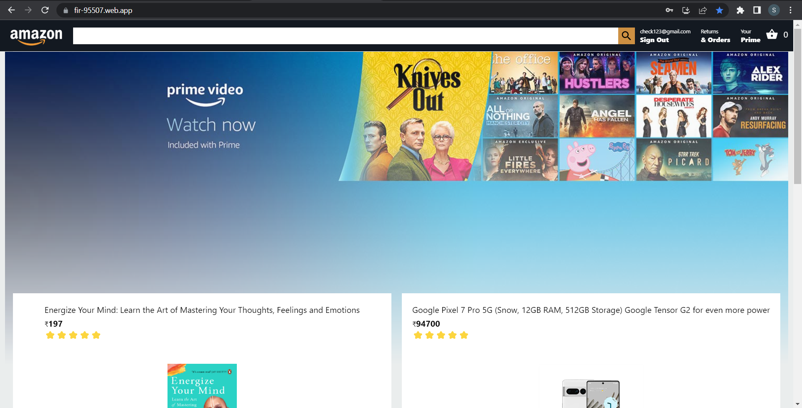
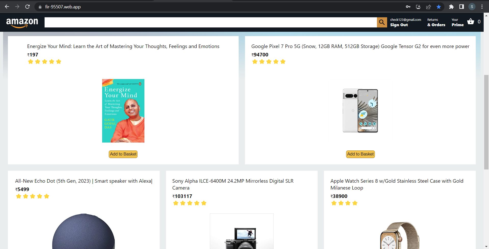
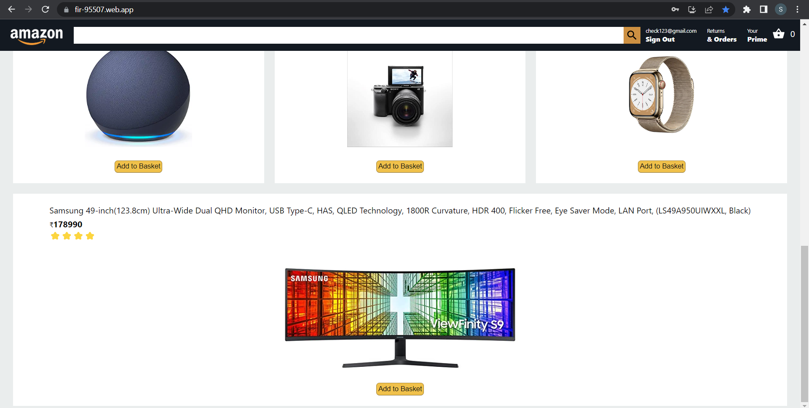
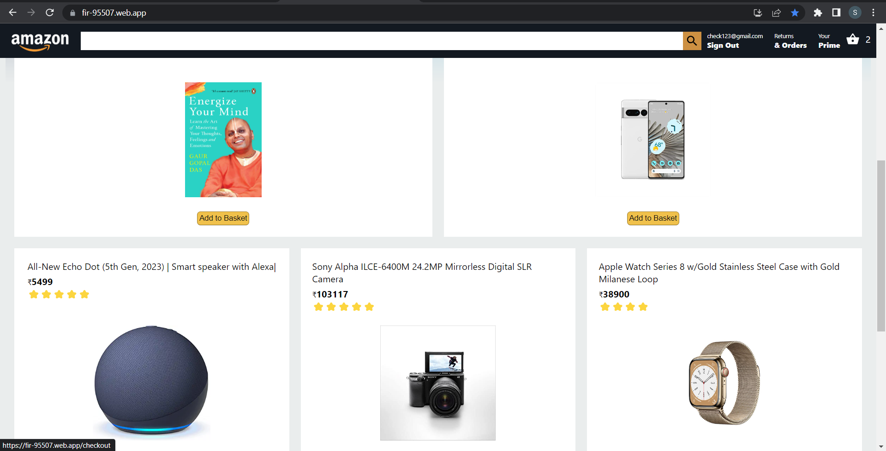
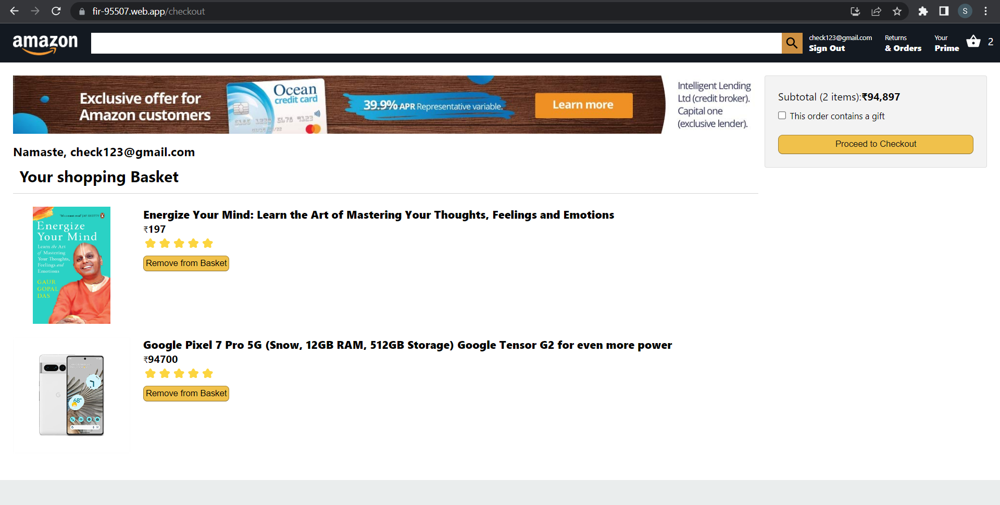
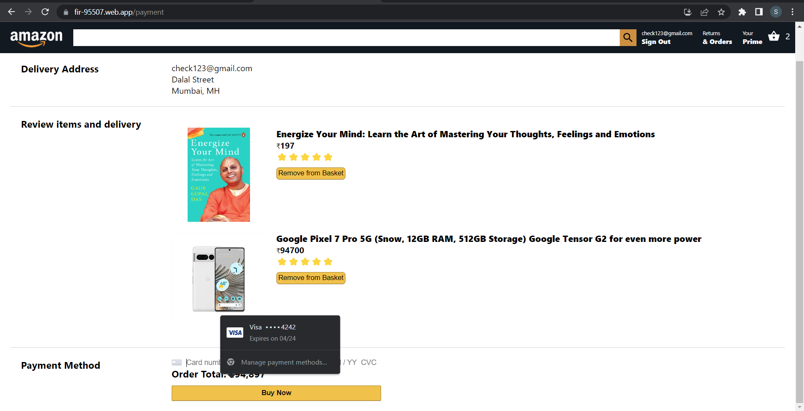
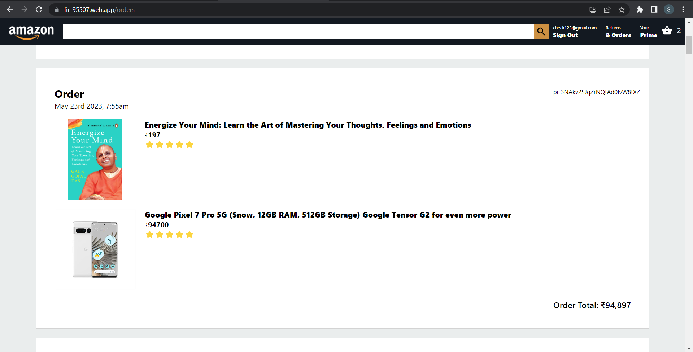

<h1 align="center">
  AMAZON
</h1>
<h3>
  Tried to clone Amazon using React.Js, firebase & stripe.
</h3>

<h4 align="center">
Live Application🚀
 
<a href="https://app-186f4.web.app">amazon-app</a>
</h4>

<h4>
  Technology Used
  

    <ul>
      Frontend:
      <li>React.js</li>
      <li>'React Hooks' to handle local state & 'React Context api' to handle global state in the app.</li>
      <li>'BEM' methodology to naming the items in HTML.</li>
    </ul>
    <ul>
      Backend:
      <li>'Firebase cloud function' + 'Express.js' to build an API & to handle all operations with database.</li>
      <li>'Firebase Authentication' to handel login/signup users.</li>
      <li>'Firebase Firestore' to store the data.</li>
      <li>'Stripe' for payment processing.</li>
    </ul>
  

</h4>

<h4>

</h4>